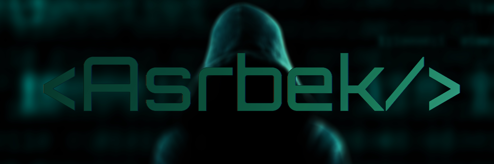

<h1 align="center" style="font-weight:700;">
  <b> Welcome to Asrbek's profile! </b>
  
</h1>

<i><b>I'm a software engineer still 1 year, who is passionate about making contributing to open-source more approachable, creating technology to elevate people, and building community. Some technologies I enjoy working with include ReactJS, NodeJs, ExpressJs, WebSocket(JavaScript, APIs + Markup) ,GraphQL and other...</b></i>
 
 
 
<h1 align="start">
🤹 My programming <b>skills: </b>
</h1>
 

  
  
  
  
  
  
  
  
  
  
  
  
  
  
  
  
  
  
  

 
 
 

 

  <a href="https://github.com/AsrbekCoder">
  
  

 
 
 

 
 
